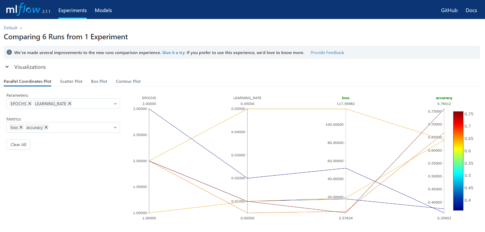

# transfer_leaning_VGG16

This repository contains the code for a binary classification project using transfer learning with the VGG-16 model. 
The project leverages MLflow for experiment tracking and management and DVC for data and pipeline tracking. Transfer learning is a powerful technique in deep learning where a pre-trained model on a large dataset is fine-tuned for a specific task. In this project, we use the VGG-16 (Visual Geometry Group) model, which is a widely used convolutional neural network (CNN) architecture. After training, the model's performance metrics and experiment details can be visualized through the MLflow UI. This includes accuracy, loss, and other relevant metricsIt uses MLflow for model version control and experimentation based on different parameters. While DVC has been used for pipeline version control as one changes the parameters in the `params.yaml`. Changing the parameters would then require to run the command cmd `dvc repro` to train the model based on the new parameters. This project has been deployed on a web application i.e. `app.py` and can be used by running cmd `python app.py`. Docker has also been used in this project to deploy it on aws server but that is under progress.

